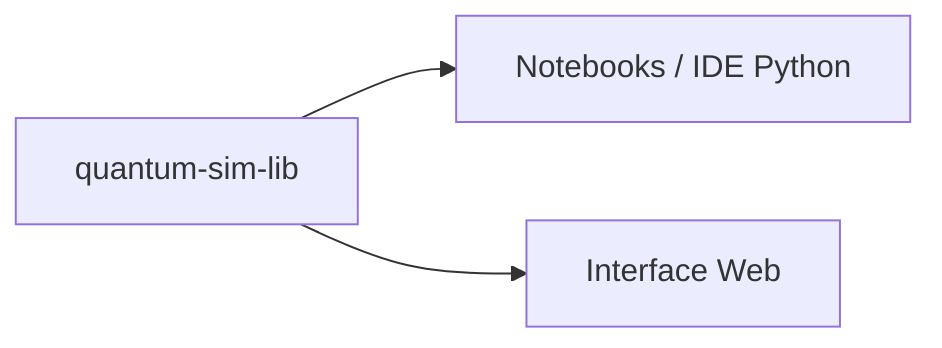

# Bienvenue sur le dépôt du Projet Mécanique Quantique avec Python !

Un projet de **simulation et de visualisation de phénomènes de mécanique quantique** développé en Python dans un objectif pédagogique.

Ce dépôt propose des outils permettant de **rendre la mécanique quantique plus accessible** grâce à la modélisation numérique et à la visualisation interactive d’objets quantiques.

---

## Table des matières

1. [Objectifs](#objectifs)
2. [Contexte](#contexte)
3. [Fonctionnalités](#fonctionnalités)
4. [Technologies](#technologies)
5. [Installation](#installation)
6. [Architecture](#architecture)
7. [Contribuer](#contribuer)
8. [Licence](#licence)

---

## Objectifs

- Illustrer les concepts fondamentaux de la mécanique quantique  
- Implémenter numériquement les équations fondamentales  
- Explorer différents cas d’étude simples et pédagogiques  
- Analyser la propagation des ondes quantiques  
- Simuler l’évolution temporelle de paquets d’ondes  

---

## Contexte

La mécanique quantique repose sur des concepts abstraits difficiles à appréhender sans support visuel.  
Les outils existants sont souvent limités, dispersés ou peu personnalisables.

Ce projet vise à proposer une **solution open source**, centralisée et évolutive, permettant aux étudiants d’explorer concrètement les phénomènes quantiques à travers la simulation et la visualisation.

---

## Fonctionnalités

- Modélisation d’ondes planes et de paquets d’ondes  
- Résolution numérique de l’équation de Schrödinger en 1D  
- Simulation de la propagation :
  - en espace libre  
  - dans des potentiels simples (puits, barrières…)  
- Visualisation de :
  - la fonction d’onde (réelle, imaginaire, complexe)  
  - la densité de probabilité  
- Analyse qualitative de phénomènes quantiques :
  - dispersion  
  - réflexion  
  - transmission  

---

## Technologies

- **Python**
- **NumPy / SciPy** – calcul scientifique et méthodes numériques  
- **Matplotlib** – visualisation et animations  
- **Jupyter Notebook** – démonstrations et cas d’étude  
- **pytest** – tests et validation du code  
- **Poetry** – gestion des dépendances et de l’environnement virtuel 

---

## Installation

Voir le guide complet [`docs/installation.md`](docs/installation.md)

## Architecture

Ce dépôt contient la **bibliothèque Python `quantum-sim-lib`**,  
qui constitue le cœur du projet.

Elle expose toutes les fonctions de simulation quantique.

Cette bibliothèque est ensuite utilisée de deux manières :

- 🧑‍💻 **Notebooks / IDE Python**  
  Pour réaliser des simulations et visualisations avec Matplotlib.

- 🌍 **Interface Web**  
  Une application web dédiée utilise la bibliothèque via WebAssembly :  
  [`Interface web QUANTUM-SIM`](https://github.com/maximedervaux/FRONT-QUANTUM-SIM)

---

### Schéma simplifié

pour voir plus de détail [`docs/architecture.md`](docs/architecture.md).

---
## 📜 Licence

Ce projet est sous licence [MIT](LICENSE). Voir le fichier LICENSE pour plus de détails.