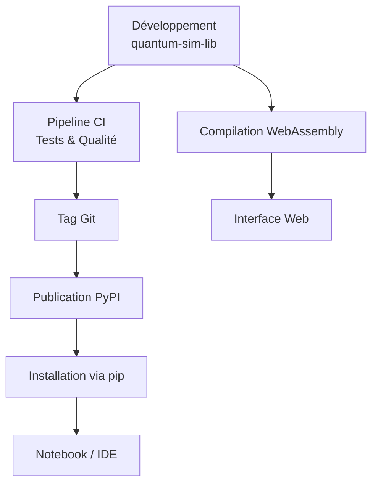
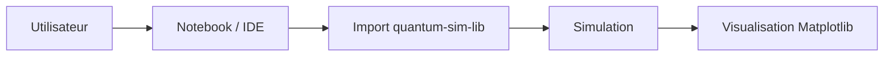
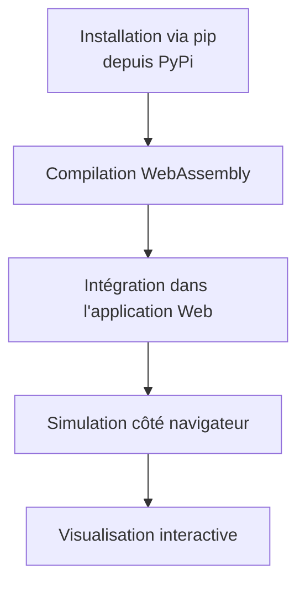

# ⚙️ Architecture – quantum-sim-lib

Ce document décrit l’architecture logicielle de la bibliothèque
**`quantum-sim-lib`**, cœur du projet de simulation quantique.

---

# Vue d’ensemble

La bibliothèque constitue la base du système.  
Elle est :

- validée via CI/CD
- publiée sur PyPI
- utilisée dans des notebooks Python
- intégrée dans une interface web via WebAssembly

---

## Schéma global


---

## Architecture du dépôt

```bash
.
├─ .github/workflows/     # Pipelines CI/CD
├─ docs/                  # Documentation
├─ src/quantumsim/        # Code source principal
│   ├─ errors/            # Exceptions personnalisées
│   ├─ potentials/        # Définition des potentiels
│   ├─ solver/            # Résolution numérique de Schrödinger
│   ├─ utils/             # Fonctions utilitaires
│   ├─ validators/        # Validation des entrées
│   └─ waves/             # Fonctions et classes liées aux ondes
├─ tests/                 # Tests unitaires (pytest)
├─ pyproject.toml         # Configuration Poetry
└─ README.md
```

---

### Modules interne de la bibliothèque

- **errors/** : Gestion des erreurs personnalisées
- **potentials/** : Définition des potentiels
- **solver/** : Résolution numérique de l’équation de Schrödinger
- **utils/** : Fonctions utilitaires
- **validators/** : Validation des entrées utilisateur
- **waves/** : Fonctions et classes liées aux ondes quantiques
- **tests/** : Tests unitaires avec pytest

---

## Notebook

Après publication sur PyPI :
```bash
pip install quantum-sim-lib
```

Flux d’utilisation :



## Web

Pour l’intégration web, la bibliothèque est d’abord installée via :

```bash
pip install quantum-sim-lib
```

Elle est ensuite compilée en WebAssembly depuis la machine de build.
Le module WebAssembly est intégré dans une application web développée avec :
- Next.js
- Plotly
- Three.js



